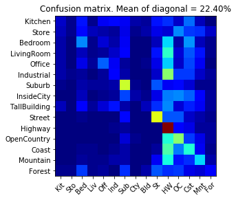
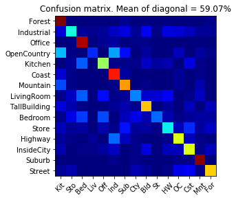
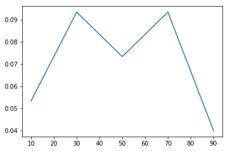
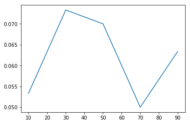
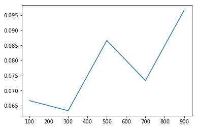
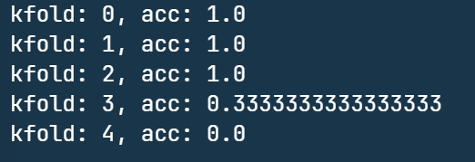
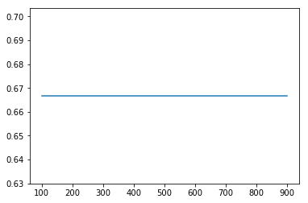
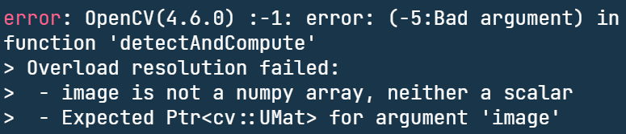
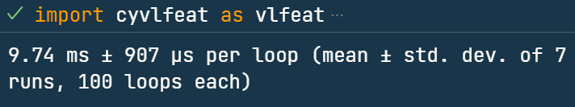
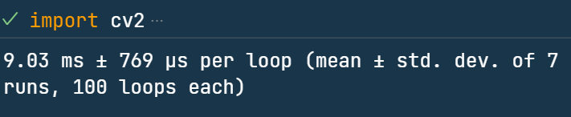

# Experiments on Bag of Visual Words for Scene Recognition

# Computer Vision Assignment 3 Report

Student Name: 叶璨铭

Student ID: 12011404

## 基础代码实现与现象观察

在开始实验调参之前，我们首先将代码填充完，将整个实验流程跑通。在这个过程中观察到一些现象，作为调参实验的设计依据。

首先实现tiny_images，初始的的准确率是15%. 接下来对feature做标准化

```python
feat = (feat - np.mean(feat)) / np.std(feat)
```

可以发现准确率显著提高7%.



注意观察多线程实现前后的时间运行差异，可以看出显著的加速。

使用词袋模型，用SVM前是52%, 使用SVM后显著提高了7%。



运行速度的观察：


## Experimental: 基于交叉验证探究词表大小与性能的关系。

### Design

- 交叉验证
  - 交叉验证的目的是为了防止测试数据的信息被训练过程用到。我们调整超参数不能根据测试集的数据上的准确率，这样有利用测试集信息的嫌疑。
  - 所以在训练集上获得验证集，然后调整超参数。
  
- 首先考虑使用`sklearn`的交叉验证，因为这个库有一系列生态，比较准确。

  - 要让我们的模型成功使用sklearn的交叉验证、调参、画auc曲线等功能，

  - 我们需要让sift分类器实现sklearn学习器的接口

    ```python
    from multiprocessing.dummy import Pool as ThreadPool
    from sklearn.base import BaseEstimator, ClassifierMixin
    from abc import ABCMeta, abstractmethod
    import joblib
    from joblib import memory
    memory = joblib.Memory('./tmp', verbose=0)
    
    c_build_vocabulary_parrallel = memory.cache(build_vocabulary_parrallel)
    c_get_bags_of_sifts = memory.cache(get_bags_of_sifts)
    c_svm_classify = memory.cache(svm_classify)
    class SiftClassifier(ClassifierMixin, BaseEstimator, metaclass=ABCMeta):
        def __init__(self, vocab_size=100, step_size=10):
            self.parameters = {'vocab_size': vocab_size, 'step_size': step_size}
        def fit(self, X, y):
            self.parameters['vocab'] = c_build_vocabulary_parrallel(X, self.parameters['vocab_size'], 2*self.parameters['step_size'])
            self.parameters['train_feats'] = c_get_bags_of_sifts(X, '', self.parameters['step_size'], 32, self.parameters['vocab'])
            self.parameters['train_labels'] = y
            return self
        def get_params(self, deep=False): 
            """为了网格搜索调参，需要实现这个函数。假装是sk家族的一员。"""
            return self.parameters
        def set_params(self, **parameters):
            self.parameters = parameters
    
        def predict(self, X):
            test_feats = c_get_bags_of_sifts(X, '', self.parameters['step_size'],32,  self.parameters['vocab'])
            return c_svm_classify(self.parameters['train_feats'], self.parameters['train_labels'], test_feats)
    
        def predict_proba(self, X):
            raise NotImplementedError("predict_proba is not implemented")
        def score(self, X, y):
            return np.mean(self.predict(X) == y)
    ```


- 这么做确实是可以了。

  - ```python
    from sklearn.model_selection import cross_val_score
    from sklearn.model_selection import KFold
    
    def evaluate_model(model, X, y):
        kfold = KFold(n_splits=5, random_state=42, shuffle=True)
        results = cross_val_score(model, X_train, y_train, cv=kfold)
        return results.mean()
    evaluate_model(sc.SiftClassifier(100, 10), X_train, y_train)
    ```

  - 但是，我们注意到每次交叉验证，单词表都要重新构建一次，其实单词表不必重新构建。这个很花时间的。

  

- 于是我们还是自己写交叉验证吧。

  - 注意 X_train 和 y_train 指的是 老师给的train_image_paths和train_labels。
  - 不能利用test里面的数据。这样也可以降低运算量。
  - 我们先建立了此表，随后才开始训练。

  ```python
  from tqdm import trange
  def evaluate_model(X_train, y_train, vocab_size=100,  kfold = 5):
      # 用整个train数据集建立词表
      vocab = sc.c_build_vocabulary_parrallel(X_train, vocab_size)
      block_size = len(X_train)//kfold
      # 分出验证集
      tr = trange(kfold)
      accs = []
      for i in tr:
          X_real_train, X_val = X_train[:i*block_size]+X_train[(i+1)*block_size:], X_train[i*block_size:(i+1)*block_size]
          y_real_train, y_val = y_train[:i*block_size]+y_train[(i+1)*block_size:], y_train[i*block_size:(i+1)*block_size]
          # 用词表建立训练集的特征
          X_train_features = sc.c_get_bags_of_sifts(X_real_train, vocab)
          # 用词表建立验证集的特征
          X_val_features = sc.c_get_bags_of_sifts(X_val, vocab)
          # 训练模型 验证模型
          test_labels = sc.c_svm_classify(X_train_features, y_real_train, X_val_features)
          # 验证集上的准确率
          acc = np.mean(test_labels == y_val)
          tr.set_description(f"kfold: {i}, acc: {acc}")
          accs.append(acc)
      return np.mean(accs)
  ```

- 仔细一看，其实feats完全也是多算了好多次。其实可以一次性把所有的feats算完，然后做交叉验证。

  ```python
  def evaluate_model(X_train, y_train, vocab_size=100,  kfold = 5):
      # 用整个train数据集建立词表
      vocab = sc.c_build_vocabulary_parrallel(X_train, vocab_size)
      block_size = len(X_train)//kfold
      # 分出验证集
      # tr = trange(kfold)
      accuracies = []
      feats = sc.c_get_bags_of_sifts(X_train, '', step=5, threads=32, vocab=vocab)
      for i in range(kfold):
          # 不要算feats，只要选择feats作为训练集和验证集就行了
          # 注意类型，这里是numpy，要用concatenate而不是+
          X_train_features = np.concatenate((feats[:i*block_size], feats[(i+1)*block_size:]), axis=0)
          y_train_labels = np.concatenate((y_train[:i*block_size],y_train[(i+1)*block_size:]), axis=0)
          X_val_features = feats[i*block_size:(i+1)*block_size]
          y_val_labels = y_train[i*block_size:(i+1)*block_size]
          # 训练模型 验证模型
          y_val_labels_pred = sc.c_svm_classify(X_train_features, y_train_labels, X_val_features)
          acc = np.mean(y_val_labels == y_val_labels_pred)
          # tr.set_description(f"kfold: {i}, acc: {acc}")
          print(f"kfold: {i}, acc: {acc}")
          accuracies.append(acc)
      return np.mean(accuracies)
  ```

### Results and Analysis

- 首先在range(100, 1000, 100) 的参数范围内进行初步实验。

  - 如果看不出规律，就放大范围；如果规律不明显，就缩小这个范围。

  - ```python
    vocab_sizes = range(100, 1000, 100)
    accs = []
    for vocab_size in vocab_sizes:
        accs.append(evaluate_model( train_image_paths, train_labels, vocab_size=vocab_size,  kfold = 4))
    plt.plot(vocab_sizes, accs)
    ```

  - 可以看到结果如下

    
    
    
    
    
    
  
- 观察到数据量上升的时候，准确率反而在下降。

  - 只有150张图片，按照上述流程训练时，验证集(30张图片)的准确率为三分之二。
    - 此时，我们观察到一个很有意思的现象，此时不管词汇表大小如何，只要范围大致合理，那么由于这150张图片可能SIFT特征加起来还比你词汇表的大小要小，所以聚类的结果很大概率是每张sift都搞一个，相当于没有怎么聚类。
    - 此时基本就是按照图像的sift特征互相匹配，可以观察到由于我们写的K折交叉验证没有shuffle，所以每个vocab_size发生的交叉验证的顺序都是一样的：
      - 

    - 
    - 将vocab_size的实验范围从`range(100,1001, 200)`降低到`range(10, 100, 20)`我们仍然能得到一样的结果。

  - 将150提高为300，在进行尝试，可以看到如下的结果
    - 


## Bonus Report (If you have done any bonus problem, state them here)

### 优化：特征提取好慢，如何舒缓跑不出来的焦虑？

#### 多线程加速计算

这个网上查查大概懂了，发现几个坑需要注意。

- Python有全局GIL锁，所以
  - 速度
    - 用多线程不如其他语言快。
    - Python的多线程对IO密集型有优化效果，对CPU密集型效果不高。
    - 我们的函数先读取了图片，然后进行了大量卷积。
    - 一开始是IO，在读取图片的时候，其他线程可以开始sift或者kmeans了，有加速效果。
    - 大家都读完图片后，加速就消失了
  - 安全性
    - 仍然要考虑线程安全问题。
    - GIL锁只是说Python指令一句一句，
    - 但是可能是这个函数一句，那个函数一句。
    - 经过我的实验验证，在做KMeans的时候（用MiniBatchKmeans），`partial_fit`函数的调用必须加锁，否则结果是错误的，因为可能有中间设置，把结果设置为零，其他线程读取错误，然后就一起错了。
- Python多进程加速
  - 共享变量是个难题。
  - 需要特殊的管理器去共享变量，可能共享失败。

#### tqdm显示进度

这个比较简单，原理也可以理解。

#### 使用GPU加速

##### 尝试Pytorch

我们知道`PyTorch`的本质与其说是深度学习框架，不如说是先支持了类似numpy API的GPU计算，然后附带一个自动微分库用来求导，以便构建神经网络。`sklearn`和`vlfeat`当然是不支持GPU加速的，但是我们传递给它们的都是numpy张量，既然`PyTorch`支持numpy的几乎所有API，我们能不能“偷梁换柱”一下，把numpy调用全部换成GPU加速的运算呢？

- 理论分析：sift计算过程首先卷积、降采样生成了大量的高斯金字塔，然后卷积求出梯度，然后求出极坐标，然后解方程找真正位置，然后找窗口和histogram给出特征。以上操作中有很多GPU友好的操作，比如卷积。
- 实际操作：

首先我们使用

```python
import torch as np
np.array = lambda x: np.Tensor(x).to('cuda')
image_gpu = np.array(image)
```

e完全没有问题，接下来在这个Python文件当中我们的产生的张量就是GPU上的了

首先对`OpenCV`的SIFT试试：

```python
%timeit kp, des = sift.detectAndCompute(image_gpu,None)
```




`OpenCV`居然用类型检查发现了不是numpy就报错了，离谱，这不python，python就是弱类型的啊！

用vlfeat试试

```python
%timeit frames, descriptors = vlfeat.sift.dsift(image_gpu, step=5, fast=True)
```

只见

```error
...
image = np.require(image, dtype=np.float32, requirements='C')
...
# Wrap Numpy array again in a suitable tensor when done, to support e.g.
...
TypeError: can't convert cuda:0 device type tensor to numpy. Use Tensor.cpu() to copy the tensor to host memory first.
```

仔细看报错信息，原来vlfeat 库也是先把传入进来的image先变成了numpy的数组。或者说它制造了一个返回值，要求image变成umpy array是这样的。

##### 尝试现成的GPU-SIFT 和 GPU-KMeans库

经过调查，SIFT的GPU实现比较冷门，难度比较高，甚至可以发论文，目前主要有以下工作：

- [GitHub - Nawter/GPUSIFT: Parallel implementation of Scale Invariant Feature Transform (SIFT)](https://github.com/Nawter/GPUSIFT)
- [目前有用GPU实现的SIFT匹配算法吗？ - 知乎 (zhihu.com)](https://www.zhihu.com/question/33913535)

然而这些基本都是需要C++\C环境的，不能直接上Python跑。

而KMeans的GPU实现非常多，有很多支持Python的库，主要有三种方法（这一篇介绍的三种）：

- [机器学习：Kmeans聚类算法总结及GPU配置加速demo - 知乎 (zhihu.com)](https://zhuanlan.zhihu.com/p/436979027)

由于这次Assignment环境太过于特殊，Python版本太低了，还必须Linux，使用WSL, 所以以上这些库的环境配置成本太高了，还不如忍受一下跑算法跑20min呢。具体困难是：

- 需要配置WSL C++环境
- 需要安装WSL cuda。 这和Windows上的cuda不一样。
- 需要正确安装在Python3.6环境下能运行的新版WSL Pytorch。
  - 安装不了，conda显示和老师给的conda环境冲突的包数不胜数。
- 需要安装Kmeans-GPU pip，首先更新pip。
- 或者自己写Pytorch，前提是安装成功。

#### 使用更快的sift实现





使用opencv来提取sift特征，比cyvlfeat稍微快70ms左右。

但是这两个算法的参数空间是不一样的，没有可比性，不能确定效果差异怎么样，因为控制方法不一样。

### 实验：最优参数演化计算


### 实验：朴素贝叶斯会不会更好？


